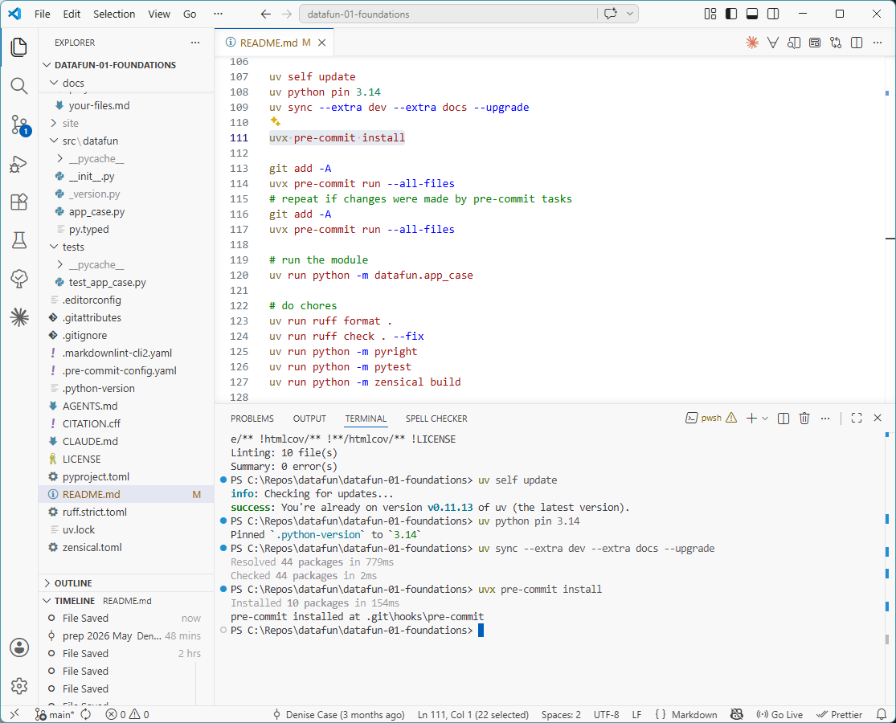

# datafun-01-foundations

[](https://denisecase.github.io/pro-analytics-02/workflow-b-apply-example-project/)
[](./pyproject.toml)
[](./LICENSE)

> Professional Python project: creating variables and running code.

Data analytics requires a variety of skills.
This course builds capabilities through working projects.

In the age of generative AI, **durable skills** are grounded in real work:
setting up a professional environment,
reading and running code,
understanding the logic,
and pushing work to a shared repository.
Each project follows the structure of professional Python projects.
We learn by doing.

## This Project

This project introduces some coding basics and **variables**
for storing data when writing instructions.

Think about different kinds of data - real or fictional.
Then think about a good name to hold that value in code.

1. A **True or False** value (e.g. `isWorking`, `isParent`, `hasPet`)
2. An **integer** (e.g. `year_starting_grad_school`)
3. A **floating point number** (e.g. `experience_factor`)
4. A **string of characters (text)** (e.g. `city`, `company_name`, `analytic_specialty`)
5. A **list of strings** (e.g., `skills`, `interests`, `favorite_teams`)

You will run the example module, read the code,
and make small modifications to understand how to choose good variable names in Python programs.

## Working Files

You'll work with just these areas:

- **docs/** - the project narrative and documentation
- **src/datafun** - where the magic happens
- **pyproject.toml** - update authorship & links
- **zensical.toml** - update authorship & links

## Instructions

Follow the
[step-by-step workflow guide](https://denisecase.github.io/pro-analytics-02/workflow-b-apply-example-project/)
to complete:

1. Phase 1. **Start & Run**
2. Phase 2. **Change Authorship**
3. Phase 3. **Read & Understand**
4. Phase 4. **Modify**
5. Phase 5. **Apply**

## Challenges

Challenges are expected.
Sometimes instructions may not quite match your operating system.
When issues occur, share screenshots, error messages, and details about what you tried.
Working through issues is part of implementing professional projects.

## Success

After completing Phase 1. **Start & Run**, you'll have your own GitHub project,
running on your machine, and running the example will print out:

```shell
========================
Executed successfully!
========================
```

A new file `project.log` will appear in the root project folder.

## Command Reference

The commands below are used in the workflow guide above.
They are provided here for convenience.

Follow the guide for the **full instructions**.

<details>
<summary>Show command reference</summary>

### In a machine terminal (open in your `Repos` folder)

After you get a copy of this repo in your own GitHub account,
open a machine terminal in your `Repos` folder:

```shell
# Replace username with YOUR GitHub username.
git clone https://github.com/username/datafun-01-foundations

cd datafun-01-foundations
code .
```

### In a VS Code terminal

```shell
# reset uv cache only after suspected cache corruption or strange dependency errors
# uv cache clean

uv self update
uv python pin 3.14
uv sync --extra dev --extra docs --upgrade

uvx pre-commit install

git add -A
uvx pre-commit run --all-files
# repeat if changes were made by pre-commit tasks
git add -A
uvx pre-commit run --all-files

# run the module
uv run python -m datafun.app_case

# do chores
uv run ruff format .
uv run ruff check . --fix
uv run python -m pyright
uv run python -m pytest
uv run python -m zensical build

# save progress
git add -A
git commit -m "your message here"

# repeat if changes were made (try the UP ARROW)
git add -A
git commit -m "your message here"

git push -u origin main
```

</details>

## Notes

- Use the **UP ARROW** and **DOWN ARROW** in the terminal to scroll through past commands.
- Use `CTRL+f` to find (and replace) text within a file.
- You do not need to add to or modify `tests/`. They are provided for example only.
- Many files are silent helpers. Explore as you like, but nothing is required.
- You do NOT not to understand everything; understanding builds naturally over time.

## Troubleshooting >>>

If you see something like this in your terminal: `>>>` or `...`
You accidentally started Python interactive mode.
It happens.
Press `Ctrl+c` (both keys together) or `Ctrl+Z` then `Enter` on Windows.

## Example Output

```shell
| INFO | P01 | ========================
| INFO | P01 | START main()
| INFO | P01 | ========================
| INFO | P01 | Generated formatted multi-line SUMMARY string.
| INFO | P01 | Returning the str to the calling function.
| INFO | P01 |
    Course Information:
        Course name: Data Analytics Fundamentals
        Course number: 608
        Course hrs/wk: 20.00
        Assumes prior experience: False
        Uses Professional Python: True
        Helpful traits: ['patience', 'curiosity', 'humor', 'tenacity']

| INFO | P01 | Generated formatted multi-line SUMMARY string.
| INFO | P01 | Returning the str to the calling function.
| INFO | P01 |
    Descriptive Statistics for Snowfall (inches):
        Total snowfall: 22.50 inches
        Count of measurements: 5
        Minimum snowfall: 2.50 inches
        Maximum snowfall: 6.50 inches
        Average snowfall: 4.50 inches
        Standard deviation: 1.58 inches

| INFO | P01 | ========================
| INFO | P01 | Executed successfully!
| INFO | P01 | ========================
```


